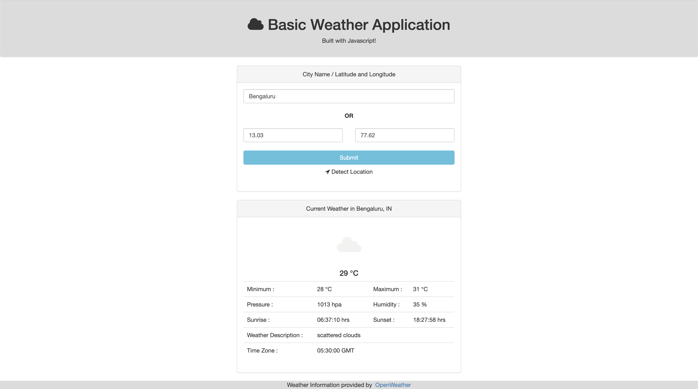

# Basic node weather app

A barebones Node.js app using [Express 4](http://expressjs.com/).

## Running Locally

Make sure you have [Node.js](http://nodejs.org/) installed.

```sh
git clone https://github.com/manojjahgirdar/basic-node-weather-app.git
cd basic-node-weather-app
npm install
npm start
```

Your app should now be running on [localhost:3000](http://localhost:3000/).

## Screenshot


